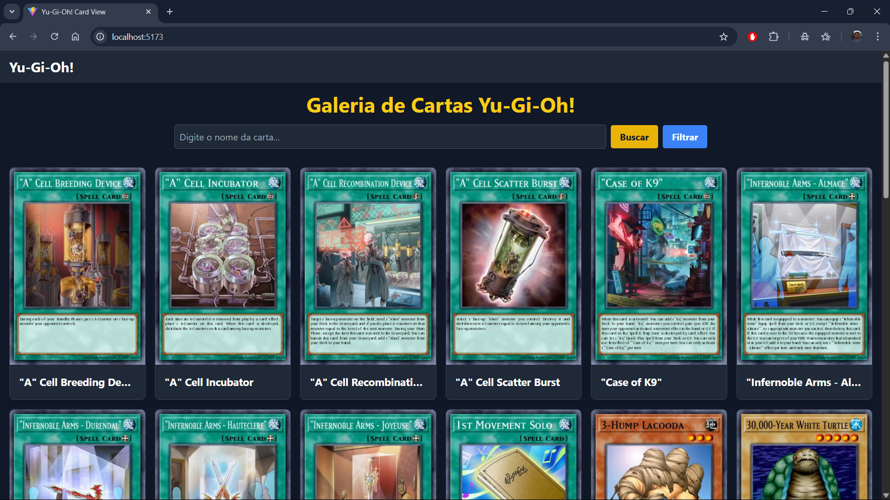
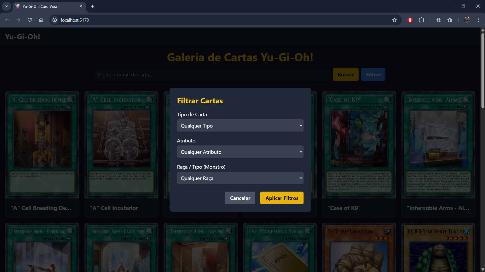
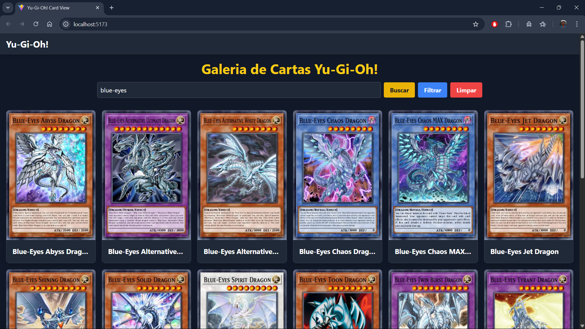
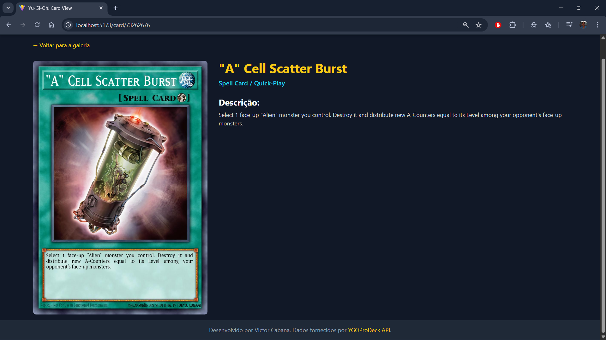

# 🃏 Yu-Gi-Oh! Card Explorer

> Uma aplicação web moderna construída com React e Vite para navegar, pesquisar e filtrar o vasto universo de cartas de Yu-Gi-Oh!

🌐 O site já está no ar:  
Acesse em **[yu-gi-oh-card-view.vercel.app](https://yu-gi-oh-card-view.vercel.app/)** e explore as cartas direto do navegador.


_Tela principal com a galeria e as ferramentas de busca e filtro._

---


_Tela com os parâmetros de filtro._

---


_Tela com as cartas correspondentes ao nome inserido na barra de busca._

---


_Tela de visualização de detalhes da carta._

---

## ✨ Funcionalidades Principais

- **Galeria de Cartas:** Navegue por milhares de cartas com paginação para uma performance otimizada.
- **Busca Unificada:** Uma única barra de busca para encontrar cartas por nome, com resultados paginados.
- **Sistema de Filtro Avançado:** Filtre cartas por tipo, atributo e raça para encontrar exatamente o que você precisa.
- **Visualização de Detalhes:** Clique em qualquer carta para ver seus detalhes completos, incluindo estatísticas e descrição.

## 🛠️ Tecnologias Utilizadas

Este projeto foi construído utilizando um conjunto de tecnologias modernas do ecossistema JavaScript:

- **Vite:** Como ferramenta de build e servidor de desenvolvimento, garantindo uma experiência de desenvolvimento extremamente rápida.
- **React.js:** Para a construção de toda a interface de usuário de forma componentizada e reativa.
- **Tailwind CSS:** Para a estilização, utilizando uma abordagem de classes utilitárias que permite a criação de layouts complexos e responsivos rapidamente.
- **React Router:** Para o gerenciamento de rotas e navegação.
- **Axios:** Para realizar as requisições HTTP à API de forma robusta e confiável.

## 🚀 Como Executar o Projeto Localmente

Para executar este projeto localmente, siga os passos abaixo:

1.  **Clone o repositório:**

    ```bash
    git clone https://github.com/Cabana021/YuGiOh-CardView
    ```

2.  **Navegue até a pasta do projeto:**

    ```bash
    cd YuGiOh-CardView
    ```

3.  **Instale as dependências:**

    ```bash
    npm install
    ```

4.  **Inicie o servidor de desenvolvimento:**

    ```bash
    npm run dev
    ```

    O site estará disponível em `http://localhost:5173`.

## 📄 API

Todos os dados das cartas são fornecidos pela excelente e gratuita **[YGOProDeck API](https://ygoprodeck.com/api-guide/)**, mantida pela comunidade.
